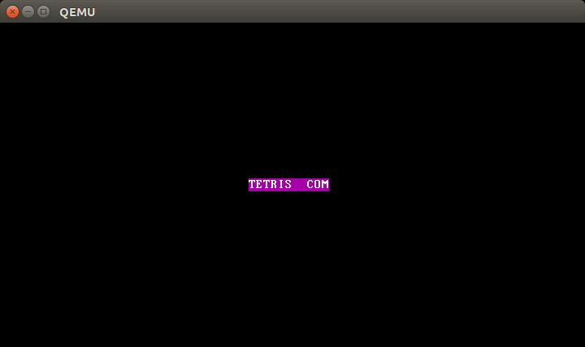
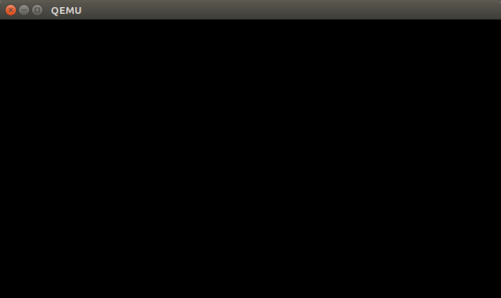
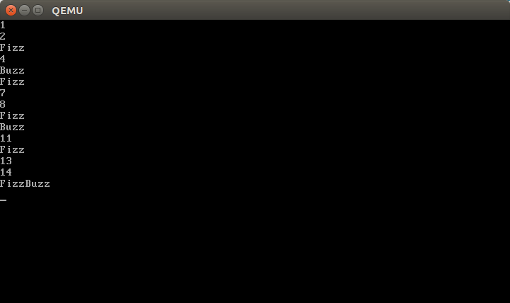

Operating system, which kernel is implemented using 512b of code (of course .vfd is greater than 512b because it is 1.44MB and have some space to install applications there)

It is a joke OS. Even it can run binary executables it was not designed to run on real hardware.

||
|:--:| 
|*OS shows 8.3 filename of selected file*|

||
|:--:| 
|*OS doesn't show anything because no valid entry present in root directory*|

||
|:--:| 
|*OS is running simple FizzBuzz application*|

Implemented:
* user interface
  * clear screen and shows current picked file
  * up and down arrow keys to select file
  * enter to start file
* searching all files on FAT12 disk
* loading COM executables
  * maximum size - 65536 bytes (it is checked)
  * loaded at 0x1000:0x0000
  * SS, CS, DS, ES points to 0x1000
  * SP points to 0xffff
  * int 21h to terminate program

Unimplemented:
* error messages
* memory protection
* file io system api
* launching more than one app api

User guide
* OS is buildable only under Linux, and I am not going to add support for Windows.
* Use ./test.sh to run application
* OS is designed to run on 1.44MB floppy
* It was not tested on real hardware, so please don't do it

Development:
* Use flags to tell assembler/compiler to output plain 16 bit binary.
* Use int 21h to exit program
* Bios interrupts are avalible
* Place your executables at initdisk
* ./build.sh to build .vfd
* ./test.sh to run qemu and test
* FizzBuzz is example of valid assembly 512b OS application.

Some code is used from http://www.brokenthorn.com/Resources/OSDevIndex.html
